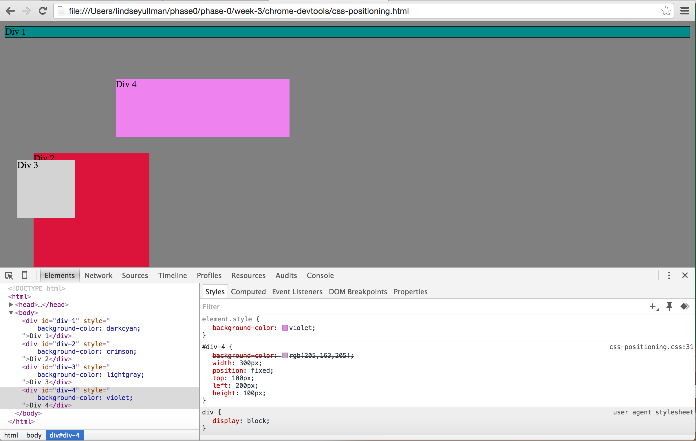
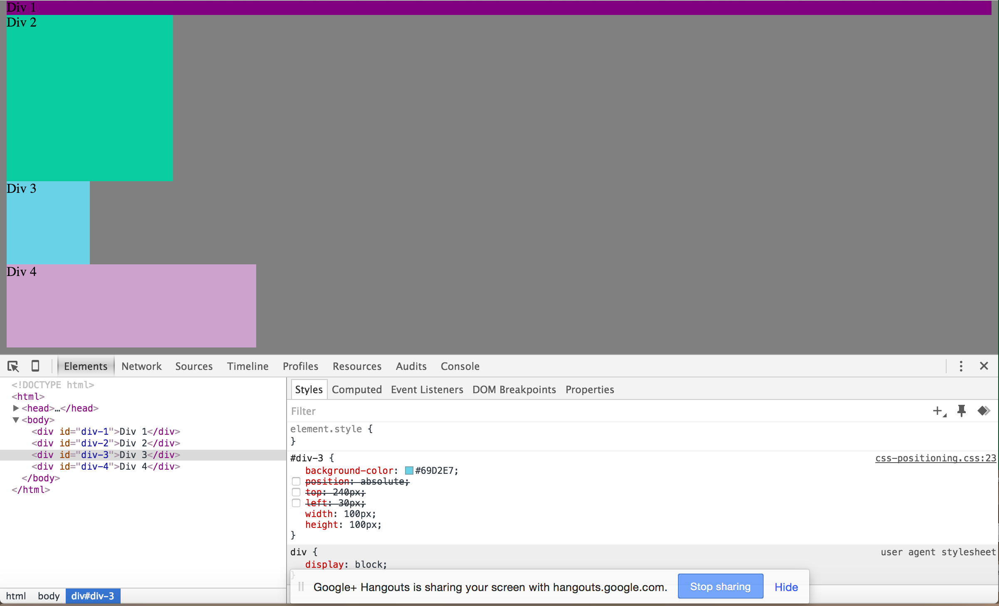
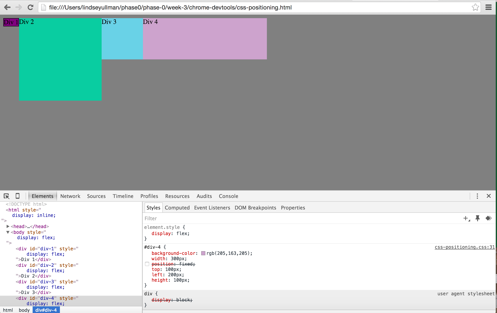
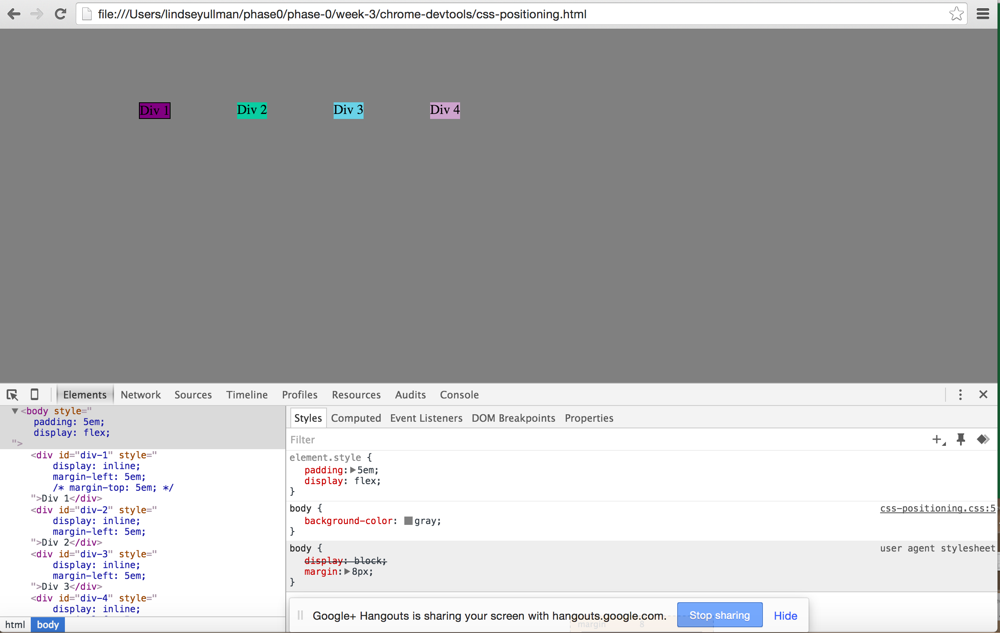
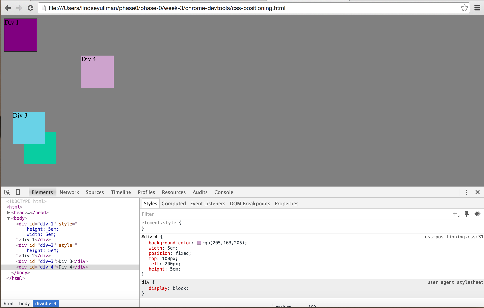
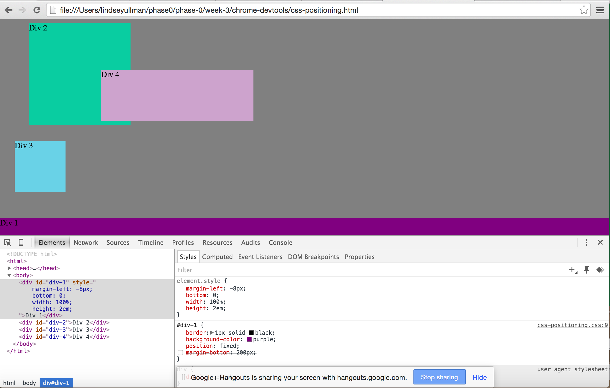
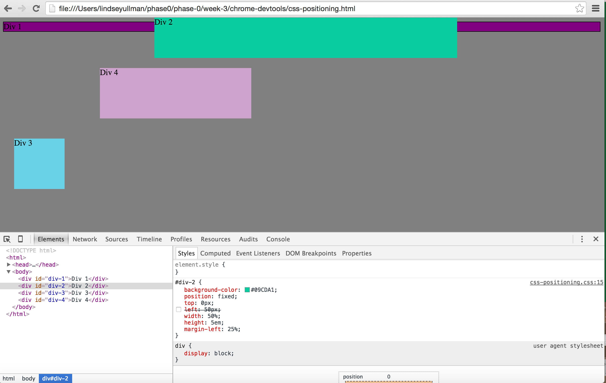
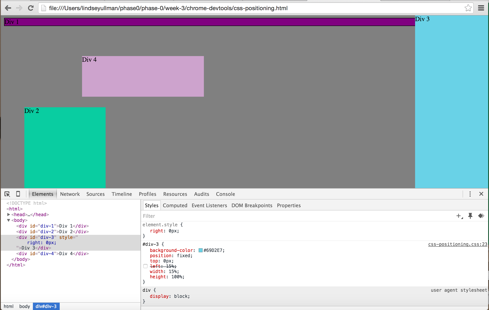
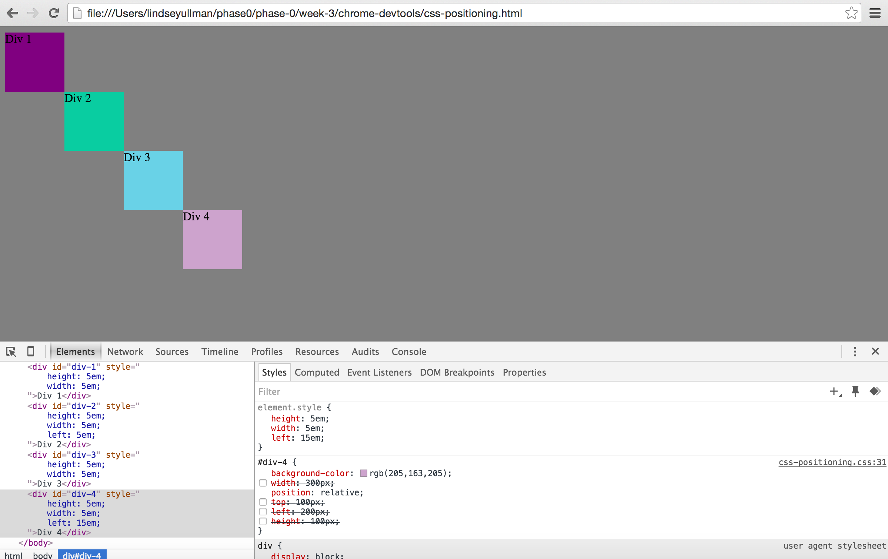

**How can you use Chrome's DevTools inspector to help you format or position elements?**
DevTools can help format and position elements because it lets you adjust CSS properties in the browser and see the results immediately.  If you don't like what the results are, you can take off the formatting or try another value until you see what you want.

**How can you resize elements on the DOM using CSS?**

**What are the differences between absolute, fixed, static, and relative positioning? Which did you find easiest to use? Which was most difficult?**
Absolute positioning places an object relative to it's parent element.  Fixed positioning places the object relative to a position in the browser window.  Static positioning places objects in order based on the previous element in the HTML.  Relative positioning places an object based on it's normal position.  For me, static is the easiest to use because I can place objects in line.  I find relative the hardest to use because it doesn't rely on the browser window or another element, it seems like the object could be placed anywhere.

**What are the differences between margin, border, and padding?**
Padding is the space immediately around the content of an object, between the content and the border.  The border can be visible if you want, and is the outline around the content and padding.  The margin is a buffer of space that surrounds the border.

**What was your impression of this challenge overall? (love, hate, and why?)**
I found this challenge to be both interesting and difficult.  It's neat to see how you can adjust the values in the browser and see the results immediately.  However, I still find it hard to determine what to do to get the results I need.

