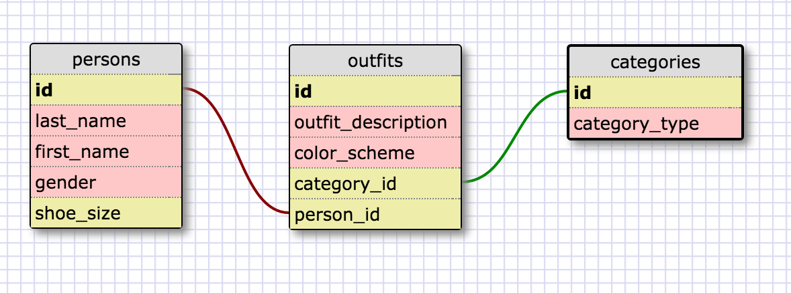

SQL Queries

Exercise 1
SELECT * FROM states;

Exercise 2
SELECT * FROM regions;

Exercise 3
SELECT state_name, population FROM states;

Exercise 4
SELECT state_name, population FROM states ORDER BY population DESC;

Exercise 5
SELECT state_name FROM states WHERE region_id = 7;

Exercise 6
SELECT state_name, population_density FROM states WHERE population_density > 50 ORDER by population_density;

Exercise 7
SELECT state_name FROM states WHERE population BETWEEN 1000000 AND 1555000;

Exercise 8
SELECT state_name, region_id FROM states ORDER BY region_id;

Exercise 9
SELECT region_name FROM regions WHERE region_name LIKE '%Central%';

Exercise 10
SELECT regions.region_name, states.state_name 
FROM regions JOIN states ON regions.id = states.region_id
ORDER BY region_id;

#Clueless Outfit Database Schema#

#Reflection#

What are databases for?
Databases are used for storing data.  They are especially useful for storing large quantities of data grouped into separate tables (like lists) if necessary

What is a one-to-many relationship?
A one-to-many relationship is where two tables are connected, having one entry on the first table, and possibly several related entries in the other table.  For example, tables of authors and books would have one entry in the author table and multiple corresponding books in the other table.

What is a primary key? What is a foreign key? How can you determine which is which?
A primary key is a field that represents a unique value for each row in a table.  For example, in a table of employees each record may have an employee id.  A foreign key is a field in a table that connects to a primary key in another table.  For employees, there may be a table of email addresses, each address may have an employee id on it, which is the foreign key pointing back to the employees table.  You can tell which is which because the primary key cannot contain any duplicate entries throughout the table, and if proper naming conventions are used, the foreign key should describe the table it is connecting to.

How can you select information out of a SQL database? What are some general guidelines for that?
You can use a select query to get information out of a SQL database.
Some guidelines to follow, the syntax generally follows this pattern...
SELECT field_name1, field_name2, field_name3 (etc) 
FROM table_name
WHERE your criteria goes here
ORDER BY field_names to surt

Additionally, you can also use a * to select all fields.  The where clause supports different options like =, >, <, and patterns using LIKE and wildcards.
