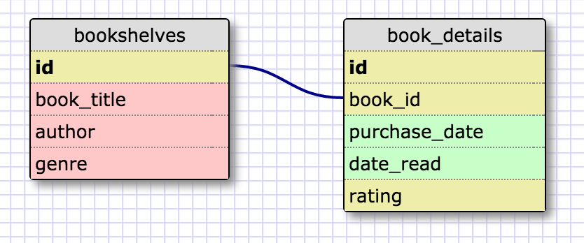
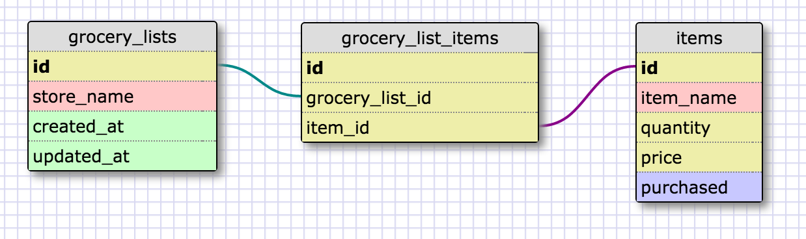

#One to one Relationship#

#Many to many Relationship#

#Reflection#
What is a one-to-one database?
A one-to-one database is a relationship where there is data in two different tables, but still has only one row in each table for each record.

When would you use a one-to-one database? (Think generally, not in terms of the example you created).
You would use a one-to-one database if you run into a restriction on the number of fields that your database will allow in a table, and cause you to need to split the data into two tables.  You would also use a one-to-one database to separate certain fields from the rest of the table in cases where those fields could be missing or null, but if populated there would still be only one row of data in each table.

What is a many-to-many database?
A many-to-many database is a relationship where data in two different tables can have multiple rows in both tables.  You would connect the data by creating a third table in between the two tables that stores the foreign keys for both tables.

When would you use a many-to-many database? (Think generally, not in terms of the example you created).
A many-to-many database is used when multiple rows can belong to multiple entries in the other table.

What is confusing about database schemas? What makes sense?
Most of this makes sense, as I've done a fair amount of database work and design in my current job.  Although I find it difficult to explain a many-to-many relationship in general terms, even though I think I know when to use one.
